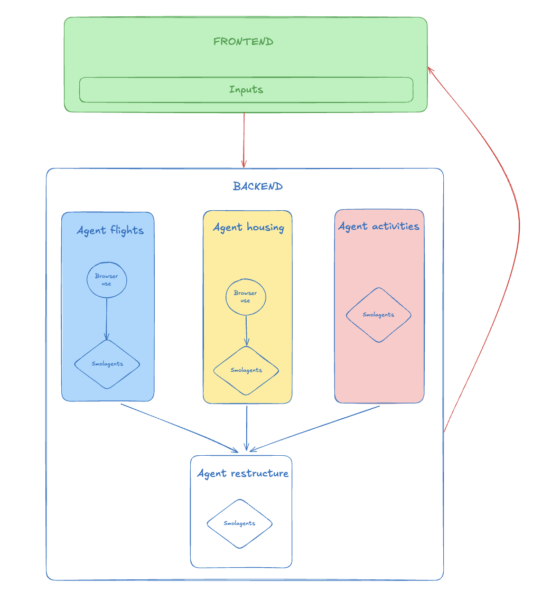

# Travel Planning Agent

An AI-powered travel planning system that generates personalized travel packages with flights, accommodations, and activities.

## Features

- **Multi-budget Packages**: Generates three different budget tiers (low, medium, high) for each trip
- **Comprehensive Planning**: Includes flights, accommodations, and activities
- **Real-time Research**: Uses web search to find current prices and availability
- **Structured Output**: Returns well-formatted travel packages with all necessary details

## Installation

```bash
# Clone the repository
git clone https://github.com/yourusername/travel-planning-agent.git
cd travel-planning-agent

# Create and activate virtual environment
python -m venv .venv
source .venv/bin/activate  # On Windows: .venv\Scripts\activate

# Install dependencies
pip install -r requirements.txt
```

## Usage

```python
from loulou.travel_agent import run_travel_agent

# Generate travel plans
plans = run_travel_agent(
    n_travelers=2,
    arrival_date="2025-06-16",
    departure_date="2025-06-26",
    departure="Paris",
    arrival="Tokyo"
)

```
## Technical Description



### Core Technologies
- **smolagents**: AI agent framework for orchestrating complex tasks
- **Anthropic Claude**: Advanced language model for natural language understanding
- **HuggingFace**: Model hosting and inference
- **browser-use**: Web automation and interaction framework

### Agent Architecture

The system is composed of four specialized agents working in concert:

1. **Flight Agent**
   - Searches and compares flight options
   - Extracts pricing and schedule information
   - Validates availability and booking conditions

2. **Housing Agent**
   - Researches accommodation options
   - Analyzes location and amenities
   - Compares prices across different platforms

3. **Activities Agent**
   - Recommends local attractions and experiences
   - Integrates with DuckDuckGo for real-time information
   - Categorizes activities by type and budget

4. **Structure Agent**
   - Coordinates the final output format
   - Ensures data consistency
   - Generates comprehensive travel packages

### Implementation Details

#### Flight and Housing Research
We implemented a hybrid approach combining browser-use and smolagents:
1. browser-use initiates the search and navigates to relevant results
2. A callback triggers the transition to smolagents with Selenium
3. This approach significantly reduces execution time while maintaining accuracy

#### Activities Research
- Utilizes a dedicated smolagent instance
- Integrates with DuckDuckGo for real-time activity information
- Processes and structures activity recommendations

#### Output Structuring
- Implements a robust structured output system using smolagents
- Ensures consistent JSON formatting
- Validates data integrity through Pydantic models

### Performance Considerations
- Optimized agent interactions to minimize API calls
- Implemented caching for frequently accessed data
- Balanced between speed and accuracy in web scraping

## Project Structure

```
.
├── docs/
│   └── travel_agent.py      # Main travel planning agent
├── src/
│   └── loulou/
│       ├── activities_agent.py  # Activities recommendation agent
│       ├── browser_use_tools.py # Browser automation tools
│       ├── classes.py           # Pydantic models
│       └── smolagents_tool.py   # Custom smolagents tools
└── requirements.txt
```

